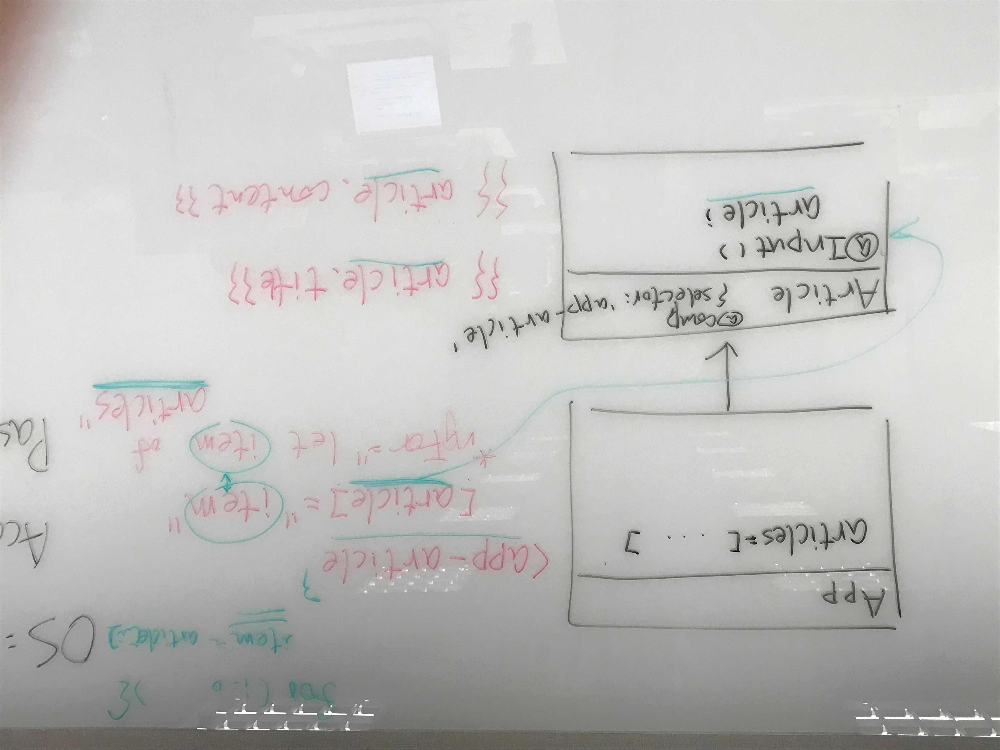
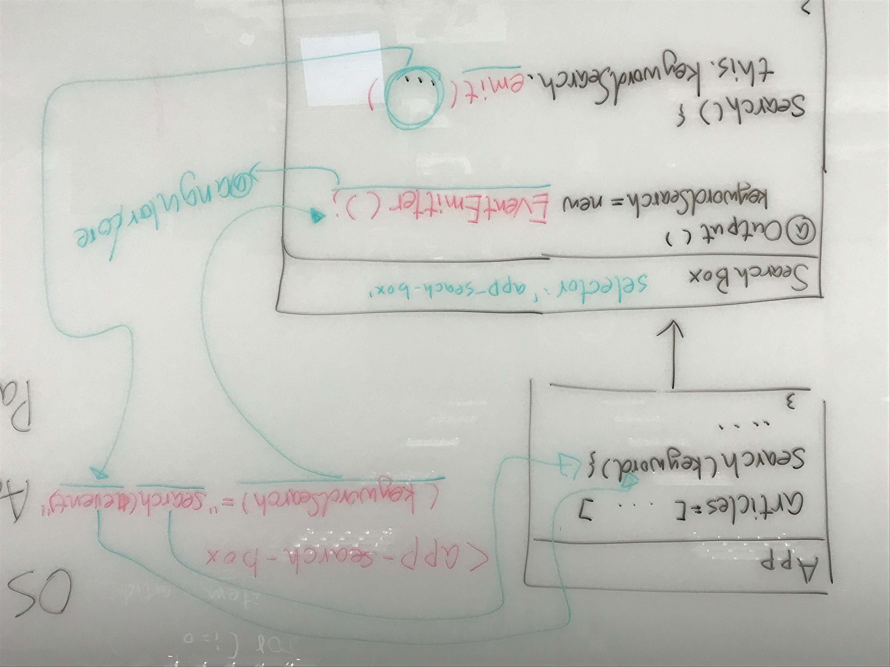

# cub-angular-20190322

## 熱鍵表
- Windows => https://code.visualstudio.com/…/keyboard-shortcuts-windows.…
- Mac => https://code.visualstudio.com/…/keyboard-shortcuts-macos.pdf

- 全部儲存：
    - [Win] ctrl + k, s
    - [Mac] cmd + option + s

- 切換關聯檔案
    - [Win] alt + o
    - [Mac] option + shift + o

- 快速開啟檔案
    - [Win] ctrl + p
    - [Mac] cmd + p

- 開啟/關閉左邊的 siderbar
    - [Win] ctrl + b
    - [Mac] cmd + b

- 開啟/關閉檔案總管
    - [Win] ctrl + shift + e
    - [Mac] cmd + shift + e

- 開啟/關閉搜尋視窗
    - [Win] ctrl + shift + f
    - [Mac] cmd + shift + f

- 開啟/關閉原始檔控制(git)
    - [Win/Mac] ctrl + shift + g

- 自動排版
    - alt + shift + f (記得設定 prettier.singleQuote)

## Emmet

https://docs.emmet.io/abbreviations/syntax/

## Input 資料流



## Output 資料流



## 使用 Chrome 偵錯

1. 打開 `F12`
2. `Source` 頁籤
3. `ctrl + p` 搜尋 ts 檔
4. 加入中斷點

## 使用 VSCode 偵錯

1. 建立 `.vscode/launch.json`

```json
{
  // 使用 IntelliSense 以得知可用的屬性。
  // 暫留以檢視現有屬性的描述。
  // 如需詳細資訊，請瀏覽: https://go.microsoft.com/fwlink/?linkid=830387
  "version": "0.2.0",
  "configurations": [{
    "type": "chrome",
    "request": "launch",
    "name": "Angular Debug",
    "url": "http://localhost:4200",
    "webRoot": "${workspaceRoot}/src",
    "sourceMapPathOverrides": {
      "webpack:///./src/*": "${webRoot}/*"
    }
  }]
}
```

2. 使用 `F5` 開始偵錯